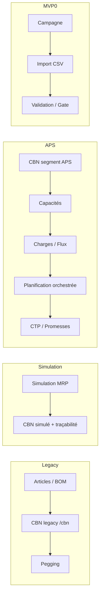

# Documentation complète — Montepull / Axioplan Gammes & Nomenclatures

> **Date de génération** : 22 juillet 2026  
> **Méthode** : cartographie statique du dépôt (code, SQL, tests, docs existantes). Aucune modification du code applicatif.  
> **Légende statut** : ✅ Terminé · 🟡 Partiel / démo · 🔴 Prototype / orphelin / dette

---

## 1. Architecture globale

### 1.1 Stack technique

| Couche | Technologie |
|--------|-------------|
| UI | Blazor Server (.NET), composants Razor interactifs |
| Application | Services orchestrateurs, DTOs (`Application/`) |
| Domaine | Moteurs purs CBN, pegging, BOM, APS, MVP-0 (`Domain/`) |
| Persistance | SQL Server via Dapper (`Infrastructure/`) |
| Tests | xUnit Domain (117 tests), Playwright E2E, Python legacy |
| Legacy | Module Python `axioplan/` (CBN, pegging, génération) |

### 1.2 Solution .NET (6 projets)

```
Axioplan.GammesNomenclatures.sln
├── Domain                    — moteurs métier sans I/O
├── Application               — services, modèles, abstractions repositories
├── Infrastructure            — SQL Server, import Excel, bootstrap schémas
├── Web                       — Blazor Server, pages, layout
├── Domain.Tests              — tests unitaires moteurs
└── E2E.Tests                 — Playwright (routes, APS, MVP-0)
```

### 1.3 Injection de dépendances

- `Application/DependencyInjection.cs` : enregistrement des services métier (CBN, Simulation, Articles, Import, Stock, APS, MVP-0…).
- `Infrastructure/DependencyInjection.cs` : repositories SQL Server + bootstrap `ApsSchemaBootstrap`, `Mvp0` au démarrage.

### 1.4 Schémas SQL (groupes de tables)

| Groupe | Fichiers / bootstrap | Rôle |
|--------|----------------------|------|
| **Core** | `database/schema.sql` | Articles, BOM, gammes, CBN legacy, pegging, paramètres, import |
| **Simulation MRP** | `sim_cbn_schema.sql`, tables `sim_*` | Simulations, variantes, CBN simulé, historique runs |
| **Stock** | colonnes/tables stock | `stock_balances`, `stock_lot_lines` |
| **MVP-0** | `mvp0_schema.sql`, `SqlServerMvp0Repository` | Campagnes, imports CSV, gate, scores |
| **APS** | `database/aps_*.sql`, `ApsSchemaBootstrap.cs` | ~60 tables : journal, attendus, capacités, flux, CTP, phase 9 |

### 1.5 Flux métier principal (vue d'ensemble)



---

## 2. Navigation et pages (inventaire)

### 2.1 Menu principal (`MainLayout.razor`)

| Lien menu | Route | Statut |
|-----------|-------|--------|
| MVP-0 | `/mvp0` | 🟡 |
| Simulation | `/` | ✅ |
| Simulation MRP | `/simulation-mrp` | ✅ |
| Imports | `/imports` | ✅ |
| Paramètres | `/parametres` | ✅ |
| Articles (dropdown) | `/articles`, `/articles/{section}` | ✅ |
| Pegging | `/pegging` | ✅ |
| Stock | `/stock` | ✅ |
| Prototype / APS (dropdown) | `/aps/*` | 🟡 |

**Absent du menu** : `/cbn` (CBN legacy — page toujours accessible), `/aps/planification` (accessible via Hub APS).

### 2.2 Toutes les routes Blazor

| Route | Fichier | Description | Statut |
|-------|---------|-------------|--------|
| `/` | `Simulation.razor` | Simulation nomenclatures / génération | ✅ |
| `/simulation-mrp` | `SimulationMrp.razor` | Simulation MRP complète + CBN + Stock + traçabilité | ✅ |
| `/articles` | `Articles.razor` | Liste articles (défaut) | ✅ |
| `/articles/create` | idem | Création manuelle | ✅ |
| `/articles/configure` | idem | Configurateur génération | ✅ |
| `/articles/categories` | idem | Catégories | ✅ |
| `/articles/families` | idem | Familles | ✅ |
| `/articles/options` | idem | Options | ✅ |
| `/articles/format` | idem | Test format code | ✅ |
| `/imports` | `Imports.razor` | Import Excel commandes + BOM | ✅ |
| `/parametres` | `Parametres.razor` | Formules, arguments, pertes, params CBN | ✅ |
| `/cbn` | `Cbn.razor` | CBN legacy (hors menu) | 🟡 |
| `/pegging` | `Pegging.razor` | Pegging besoins / offres | ✅ |
| `/stock` | `Stock.razor` | Lots, synthèse, nomenclatures + filtres | ✅ |
| `/mvp0` | `Mvp0/Mvp0Home.razor` | Campagnes MVP-0 | 🟡 |
| `/mvp0/workflow/{id}` | `Mvp0/Mvp0Workflow.razor` | Parcours 10 étapes | 🟡 |
| `/mvp0/imports` | `Mvp0/Mvp0Imports.razor` | Import CSV versionné | 🟡 |
| `/mvp0/{section}` | `Mvp0/Mvp0Sections.razor` | Sections détaillées | 🟡 |
| `/aps` | `ApsHub.razor` | Hub APS | 🟡 |
| `/aps/journal` | `ApsJournal.razor` | Journal événements | 🟡 |
| `/aps/attendus` | `ApsAttendus.razor` | Attendus / expectations | 🟡 |
| `/aps/cbn` | `ApsCbn.razor` | CBN segment APS | 🟡 |
| `/aps/capacites` | `ApsCapacites.razor` | Évaluation capacités nettes | 🟡 |
| `/aps/charges` | `ApsCharges.razor` | Calcul charges | 🟡 |
| `/aps/flux` | `ApsFlux.razor` | Flux charge / saturation | 🟡 |
| `/aps/planification` | `ApsPlanification.razor` | Orchestration CBN→capa→flux | 🟡 |
| `/aps/ctp` | `ApsCtp.razor` | Capable-to-Promise | 🔴 |
| `/aps/promesses` | `ApsPromesses.razor` | Promesses clients | 🔴 |
| `/aps/compilateur` | `ApsCompilateur.razor` | Compilateur squelette | 🔴 |
| `/aps/contrats` | `ApsContrats.razor` | Contrats demo | 🔴 |
| `/aps/recette` | `ApsRecette.razor` | Recette / verrous demo | 🔴 |
| `/aps/cycle-nocturne` | `ApsCycleNocturne.razor` | Cycle batch | 🔴 |

---

## 3. Modules fonctionnels détaillés

### 3.1 Simulation nomenclatures (`/`)

- **Service** : `SimulationService` + `GenerationEngine` / `FormulaEngine`
- **Actions** : lancer simulation, afficher résultats génération
- **Tables** : `simulations`, tables génération liées
- **Statut** : ✅

### 3.2 Simulation MRP (`/simulation-mrp`)

- **Services** : `SimulationMrpService`, `SimulationCbnService`, `SimulationDuplicationEngine`
- **Onglets** : création simulation, article pivot, nomenclature, variantes (tailles/couleurs), paramètres CBN, **CBN** (calcul + historique runs + traçabilité), **Stock**
- **Boutons clés** : Créer, Initialiser article, + nomenclature, Générer variantes, Simuler CBN, Lancer calcul CBN, Voir (historique run)
- **Tables** : `simulations`, `sim_articles`, `sim_bom_lines`, `sim_flat_bom_lines`, `sim_cbn_runs`, `sim_cbn_results`, `sim_cbn_trace_steps`, `stock_balances` (lecture)
- **Statut** : ✅ (CBN simulé + traçabilité récents)

### 3.3 Articles (`/articles`)

- **Service** : `ArticleService`, `ArticleConfiguratorEngine`
- **Sections** : list (défaut), create, configure, categories, families, options, format
- **Fonctions** : CRUD catégories/familles/options, création manuelle, configurateur multi-options, duplication article, panneau traçabilité inline
- **Tables** : `articles`, `article_families`, `article_categories`, `article_options`, BOM/gammes liées
- **Statut** : ✅

### 3.4 Imports (`/imports`)

- **Service** : `ImportService` → `SqlServerImportRepository`
- **Types** : import **commandes** Excel, import **BOM** Excel (analyse, preview, mapping profiles)
- **Boutons** : Analyser, Importer commandes, Prévisualiser BOM, Importer BOM
- **Tables** : tables import + articles/BOM selon mapping
- **Statut** : ✅

### 3.5 Paramètres (`/parametres`)

- **Service** : `ParameterService`
- **Contenu** : formules de génération, arguments, pertes, paramètres CBN
- **Statut** : ✅

### 3.6 CBN legacy (`/cbn`)

- **Service** : `CbnService` + `CbnEngine`
- **Note** : retiré du menu principal ; parallèle au CBN Simulation MRP et CBN APS
- **Tables** : `cbn_runs`, `cbn_results`, `cbn_needs`…
- **Statut** : 🟡 (fonctionnel mais legacy)

### 3.7 Pegging (`/pegging`)

- **Service** : `PeggingService` + `PeggingEngine`
- **Action** : Lancer pegging besoins/offres
- **Statut** : ✅

### 3.8 Stock (`/stock`)

- **Service** : `StockService` → `SqlServerStockRepository`
- **Onglets** : Détail lots, Synthèse articles, **Nomenclatures**
- **Filtres** : catégorie, famille, type, BOM, recherche ; clic ligne = filtre croisé
- **Tables** : `stock_balances`, `stock_lot_lines`, vues BOM
- **Statut** : ✅

### 3.9 MVP-0 (`/mvp0/*`)

- **Service** : `Mvp0Service`, moteurs `Mvp0Engines`, import CSV `Mvp0CsvImport`
- **Parcours** : création campagne → import seed → validation → bypass → scores → backtest → planner → gate → rapport
- **Données** : souvent seeds demo / REAL propre
- **Tables** : `mvp0_*` (~15 tables)
- **Statut** : 🟡 (workflow complet en démo)

### 3.10 APS (`/aps/*`)

| Page | Service principal | Rôle | Statut |
|------|-------------------|------|--------|
| Hub | — | Navigation modules APS | 🟡 |
| Journal | `ApsJournalService` | Événements, filtre, seed demo | 🟡 |
| Attendus | `ApsExpectationService` | Attendus planning, emit demo | 🟡 |
| CBN APS | `ApsSegmentCbnService` | CBN sur segments | 🟡 |
| Capacités | `ApsCapacityService` + `ApsCapacityEvaluator` | Capacités nettes (calendrier/régime) | 🟡 |
| Charges | `ApsFluxService` / `LoadEngine` | Charges par segment | 🟡 |
| Flux | `ApsFluxService` | Saturation, recalcul/publier | 🟡 |
| Planification | `ApsPlanningService` | Orchestration CBN → capa → flux | 🟡 |
| CTP | `ApsCtpService` | Promesse / refus | 🔴 |
| Promesses | repo CTP | Liste promesses | 🔴 |
| Compilateur | `ApsCompilerService` | Squelette recompilation | 🔴 |
| Contrats / Recette / Cycle | services phase 9 | Démos verrous, contrats | 🔴 |

### 3.11 Backend sans UI

| Composant | Fichiers | Note |
|-----------|----------|------|
| `ConsultationService` | `SqlServerConsultationRepository` | Pas de page Blazor | 🔴 |
| `planning_ai` (Python) | stub | Non intégré | 🔴 |

---

## 4. MVP-0 — périmètre et état

### 4.1 Objectif

Prototype de **gouvernance qualité données** avant planification : campagnes d'import, validation, scoring, gate go/no-go.

### 4.2 Pages et workflow

1. **Home** (`/mvp0`) : créer campagne, parcours demo bout-en-bout
2. **Workflow** (`/mvp0/workflow/{id}`) : 10 étapes numérotées (import → gate → rapport)
3. **Imports** (`/mvp0/imports`) : CSV versionné, preview/mapping, seeds anomalies ou REAL propre
4. **Sections** (`/mvp0/{section}`) : vues détaillées par section métier

### 4.3 Moteurs Domain

- `Mvp0Engines` : validation, scoring intrant/résultat, backtest, gate
- `Mvp0CsvImport` : parsing et mapping CSV

### 4.4 Séparation vs APS / Legacy

| Critère | MVP-0 | APS | Legacy |
|---------|-------|-----|--------|
| Données | Campagnes `mvp0_*` | Tables `aps_*` | `schema.sql` core |
| CBN | Non | `ApsSegmentCbnEngine` | `CbnEngine` |
| UI | Workflow campagne | Hub planification | Simulation, /cbn |
| Maturité | Démo bout-en-bout | Moteurs OK, données demo | Production Montepull |

### 4.5 Statut global MVP-0 : 🟡

---

## 5. APS — architecture planification

### 5.1 Composants clés

```
ApsPlanningService (orchestrateur)
    ├── ApsSegmentCbnService → SegmentCbnEngine
    ├── ApsCapacityEvaluator → NetCapacityEngine
    └── ApsFluxService → LoadEngine, SaturationEngine
```

### 5.2 Fichiers principaux

| Fichier | Rôle |
|---------|------|
| `Domain/Aps/NetCapacityEngine.cs` | Capacité nette (calendrier, régime, indispos) |
| `Domain/Aps/FluxEngines.cs` | Charge, saturation |
| `Domain/Aps/SegmentCbnEngine.cs` | CBN par segment |
| `Domain/Aps/CtpEngines.cs` | CTP (non unifié avec NetCapacity) |
| `Application/Aps/ApsPlanningService.cs` | Enchaînement complet |
| `Application/Aps/ApsCapacityEvaluator.cs` | Façade capacités référentiel |
| `Infrastructure/Aps/ApsSchemaBootstrap.cs` | Création tables APS |

### 5.3 Page Planification (`/aps/planification`)

- Bouton **Lancer planification complète** : persiste run CBN APS, résout lancements, évalue capacités, calcule flux
- `PersistRunAsync` retourne `long` (id run)
- `ResolveLaunchesFromCbnRunAsync` : artefacts CHARGES, répartition fenêtre

### 5.4 État réel

| Capacité | Moteur | Données prod | UI |
|----------|--------|--------------|-----|
| Capacités nettes | ✅ | 🟡 demo | ✅ |
| Charges | ✅ | 🟡 demo | ✅ |
| Flux / saturation | ✅ | 🟡 demo | ✅ |
| CBN segment | ✅ | 🟡 | ✅ |
| Orchestration | ✅ | 🟡 | ✅ |
| CTP unifié | 🔴 | 🔴 | 🟡 |
| Compilateur | 🔴 squelette | — | 🟡 |

### 5.5 Statut global APS : 🟡 (fondation solide, intégration données réelles à faire)

---

## 6. CBN — trois implémentations

| Implémentation | Route / contexte | Moteur | Persistance | Historique |
|----------------|------------------|--------|-------------|------------|
| **Legacy** | `/cbn` | `CbnEngine` | `cbn_*` | Basique |
| **Simulation MRP** | `/simulation-mrp` onglet CBN | `SimulationCbnEngine` | `sim_cbn_runs`, `sim_cbn_results`, trace | ✅ Historique + traçabilité |
| **APS segment** | `/aps/cbn` | `SegmentCbnEngine` | `aps_*` segment CBN | Runs APS |

### 6.1 Simulation MRP CBN (détail)

- Tables ajoutées : `sim_cbn_runs`, `sim_flat_bom_lines`, `cbn_run_id` sur résultats
- API : `ListCbnRunsAsync`, `GetCbnRunResultAsync`, `SimCbnTraceStepDto`
- Les runs ne sont plus effacés à chaque relance

### 6.2 Recommandation

Consolider à terme sur **un seul modèle de run + traçabilité** réutilisable par APS (cf. feuille de route §15).

---

## 7. Charges et capacités

### 7.1 Capacités (`ApsCapacityEvaluator` + `NetCapacityEngine`)

- Entrées : calendrier, régime de travail, indisponibilités (référentiel APS)
- Sortie : capacité nette par segment / période
- Page : `/aps/capacites` — Calculer, Réserver 1u demo

### 7.2 Charges (`LoadEngine` dans `FluxEngines.cs`)

- Dérive des besoins / lancements CBN APS
- Page : `/aps/charges` — Calculer charges
- Artefacts liés aux runs planification (`ResolveLaunchesFromCbnRunAsync`)

### 7.3 Flux et saturation (`SaturationEngine`)

- Compare charge vs capacité
- Page : `/aps/flux` — Recalculer / Publier

### 7.4 Lacunes connues

- Données souvent **demo** (boutons seed/emit demo sur plusieurs pages APS)
- CTP utilise un chemin séparé, pas encore branché sur `NetCapacityEngine`
- Pas de visualisation Gantt industrielle

---

## 8. Articles — référentiel et configurateur

### 8.1 Modèle (`ArticleModels.cs`)

- Types article, familles, catégories, options, format de code
- Traçabilité : historique modifications (panneau sur liste)

### 8.2 Sections UI

| Section | Route | Fonction |
|---------|-------|----------|
| list | `/articles` | Liste filtrable, traçabilité, duplication |
| create | `/articles/create` | Création manuelle |
| configure | `/articles/configure` | Génération multi-options |
| categories | `/articles/categories` | CRUD catégories |
| families | `/articles/families` | CRUD familles |
| options | `/articles/options` | CRUD options (statut À valider) |
| format | `/articles/format` | Test formateur code |

### 8.3 Moteurs

- `ArticleConfiguratorEngine` : génération combinaisons
- `BomFlattener` : nomenclatures à plat (simulation + stock)

### 8.4 Statut : ✅

---

## 9. Imports

### 9.1 Import Excel commandes

- `AnalyzeOrderWorkbookAsync` → `ImportOrderAsync`
- Profils de mapping : `GetMappingProfilesAsync`

### 9.2 Import Excel BOM

- `AnalyzeBomWorkbookAsync` → `PreviewBomImportAsync` → `ImportBomAsync`
- UI : analyse, preview tableau, import

### 9.3 Scripts Python complémentaires

- `scripts/import_stocks.py` — stocks Montepull
- `init_db.py` — initialisation base

### 9.4 Tables

- Tables import dans `schema.sql` + tables articles/BOM cibles

### 9.5 Statut : ✅ (Excel) · 🟡 (stocks Python — hors UI Blazor)

---

## 10. Schéma SQL — inventaire synthétique

### 10.1 Core (`database/schema.sql`) — ~50 tables

- **Articles** : `articles`, `article_families`, `article_categories`, `article_options`…
- **BOM** : `bom_headers`, `bom_lines`, composants
- **Gammes** : opérations, ressources
- **CBN legacy** : `cbn_runs`, `cbn_results`, `cbn_needs`
- **Pegging** : allocations besoins/offres
- **Paramètres** : formules, arguments, pertes
- **Import** : logs, mappings

### 10.2 Simulation MRP

- `simulations`, `sim_articles`, `sim_bom_lines`, `sim_flat_bom_lines`
- `sim_cbn_runs`, `sim_cbn_results`, `sim_cbn_trace_steps`

### 10.3 Stock

- `stock_balances`, `stock_lot_lines`

### 10.4 MVP-0

- Préfixe `mvp0_` : campagnes, imports, validations, scores, gate

### 10.5 APS (`database/aps_*.sql` + bootstrap)

- Journal, attendus, référentiel segments/calendriers
- Capacités, réservations, charges, flux
- CBN segment, CTP, promesses, contrats, phase 9
- ~60 tables au total

---

## 11. Tests

### 11.1 Domain.Tests (xUnit) — 117 tests, 19 fichiers

| Domaine | Exemples de tests |
|---------|-------------------|
| CBN | `CbnEngineTests`, besoins, multi-niveaux |
| Pegging | allocations |
| Simulation MRP | duplication, CBN simulé, BOM |
| APS | flux, capacité, CTP, compilateur, phase 9, segment CBN |
| MVP-0 | engines, CSV import |
| Import BOM | mapping, extraction |

### 11.2 E2E.Tests (Playwright)

| Fichier | Couverture |
|---------|------------|
| `RoutesAuditTests.cs` | Routes principales (⚠️ `/aps/planification` absent) |
| `ApsPagesTests.cs` | Pages APS |
| `LegacyPagesTests.cs` | CBN, pegging, simulation |
| `Mvp0WorkflowTests.cs` | Parcours MVP-0 |

### 11.3 Python (`tests/test_*.py`)

- CBN, pegging, parameters, generation — miroir legacy `axioplan/`

### 11.4 Lacunes tests

- E2E : ajouter `/aps/planification`, `/stock` nomenclatures
- Pas de tests E2E Articles configurateur complet
- ConsultationService non testé UI (pas de page)

---

## 12. Code mort et orphelins

| Élément | Type | Action suggérée |
|---------|------|-----------------|
| `/cbn` page | UI legacy hors menu | Rediriger ou fusionner avec Simulation MRP |
| `ConsultationService` | Backend sans UI | Page consultation ou suppression |
| `planning_ai` Python | Stub | Implémenter ou retirer |
| Boutons **demo** APS | Données fictives | Remplacer par données Montepull |
| `ApsCompilerService` | Squelette | Compléter ou marquer experimental |
| CTP séparé | Architecture | Unifier avec NetCapacityEngine |
| Docs datées | `docs/ETAT_PROJET.md` (2026-07-10) | Remplacer par ce document |

---

## 13. Dette technique

### 13.1 Architecture

- **Triple CBN** (legacy, sim, APS) — duplication logique et schémas
- **APS vs MVP-0** : deux paradigmes coexistants sans pont clair
- **Python legacy** + **C# Domain** : double maintenance sur CBN/pegging

### 13.2 Données

- Nombreux `TO_CONFIRM`, `SIMULE`, seeds demo dans APS/MVP-0
- Compilateur APS non alimenté par référentiel réel

### 13.3 UI/UX

- Planification APS absente du menu (Hub seulement)
- CBN legacy accessible par URL directe uniquement

### 13.4 Qualité

- Routes E2E incomplètes
- Pas de tests d'intégration SQL bout-en-bout hors Domain

---

## 14. Documentation existante

| Fichier | Contenu | Fraîcheur |
|---------|---------|-----------|
| `docs/ETAT_PROJET.md` | État projet juillet 2026 | 🟡 |
| `docs/FINAL_PROJET.md` | Synthèse finale | 🟡 |
| `docs/aps-fondation.md` | Fondation APS | Référence |
| `docs/mvp0-*.md` | MVP-0 détails | Référence |
| `docs/RAPPORT-FINAL-MVP.md` | Rapport MVP | Historique |
| **`DOCUMENTATION_COMPLETE_APPLICATION.md`** | **Ce document** | ✅ 2026-07-22 |

---

## 15. Feuille de route recommandée

### Phase 1 — Consolidation CBN (priorité haute)

| # | Action | Statut cible |
|---|--------|--------------|
| 1 | Modèle unique `CbnRun` + traçabilité (sim → APS) | 🟡→✅ |
| 2 | Déprécier `/cbn` ou rediriger vers Simulation MRP | 🟡→✅ |
| 3 | Brancher APS CBN sur même API historique que sim | 🟡→✅ |

### Phase 2 — APS données réelles

| # | Action | Statut cible |
|---|--------|--------------|
| 4 | Alimenter référentiel segments/calendriers Montepull | 🟡→✅ |
| 5 | Remplacer seeds demo par imports production | 🟡→✅ |
| 6 | Ajouter `/aps/planification` au menu + E2E | 🟡→✅ |

### Phase 3 — Charges / capacités / CTP

| # | Action | Statut cible |
|---|--------|--------------|
| 7 | Unifier CTP avec `NetCapacityEngine` | 🔴→✅ |
| 8 | Visualisation charge vs capacité (tableau / Gantt léger) | 🟡→✅ |
| 9 | Compléter compilateur ou retirer de la nav | 🔴→🟡 |

### Phase 4 — Gouvernance et nettoyage

| # | Action | Statut cible |
|---|--------|--------------|
| 10 | Page Consultation ou suppression service | 🔴→✅ |
| 11 | Décision MVP-0 : intégrer gate qualité dans APS ou garder séparé | 🟡 |
| 12 | Retirer / archiver module Python si parity C# validée | 🟡→✅ |
| 13 | Compléter couverture E2E (stock, articles, planification) | 🟡→✅ |

### Synthèse maturité par zone

| Zone | Aujourd'hui | Cible 3 mois |
|------|-------------|--------------|
| Simulation MRP + CBN sim | ✅ | ✅ |
| Articles / Imports / Stock | ✅ | ✅ |
| Pegging / Paramètres | ✅ | ✅ |
| APS moteurs | 🟡 | ✅ |
| APS données prod | 🔴 | 🟡 |
| MVP-0 | 🟡 | 🟡 |
| CBN legacy | 🟡 | 🔴 (déprécié) |
| CTP / Compilateur | 🔴 | 🟡 |

---

## Annexe A — Repositories enregistrés (`Infrastructure/DependencyInjection.cs`)

- `SqlServerSimulationRepository`
- `SqlServerSimulationCbnRepository`
- `SqlServerArticleRepository`
- `SqlServerParameterRepository`
- `SqlServerCbnRepository`
- `SqlServerPeggingRepository`
- `SqlServerConsultationRepository` *(sans UI)*
- `SqlServerStockRepository`
- `SqlServerImportRepository`
- `SqlServerMvp0Repository`
- APS : Journal, Expectation, Referential, Compiler, Capacity, SegmentCbn, Flux, Ctp, Phase9

## Annexe B — Modèles Application (`Application/Models/`)

`ArticleModels`, `CbnModels`, `PeggingModels`, `ParameterModels`, `SimulationModels`, `SimulationCbnModels`, `ImportModels`, `StockModels`, `Mvp0Models`, `ApsModels`, `ApsPlanningModels`, `ApsCapacityCbnModels`, `ApsFluxModels`, `ApsCtpModels`, `ApsPhase9Models`

## Annexe C — Moteurs Domain (`Domain/`)

`CbnEngine`, `PeggingEngine`, `GenerationEngine`, `FormulaEngine`, `BomFlattener`, `SimulationCbnEngine`, `SimulationDuplicationEngine`, `ArticleConfiguratorEngine`, `Mvp0Engines`, `Mvp0CsvImport`, `NetCapacityEngine`, `LoadEngine`, `SaturationEngine`, `SegmentCbnEngine`, `CtpEngines`, `Phase9Engines`, compilateur squelette APS

---

*Fin du document — généré par cartographie statique du dépôt Montepull, sans modification du code applicatif.*
