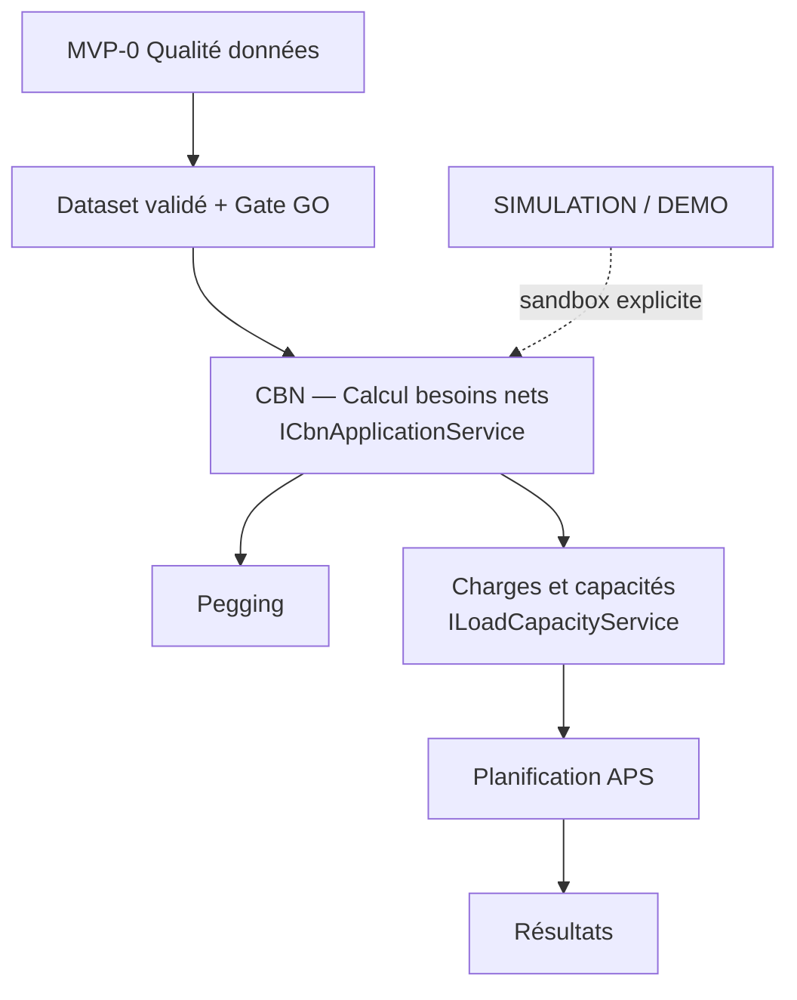

# MATRICE DE CONSOLIDATION TECHNIQUE

> **Date** : 22 juillet 2026  
> **Phase** : Étape 1 — analyse et décisions **avant** modification du code  
> **Sources obligatoires consultées** : `DOCUMENTATION_COMPLETE_APPLICATION.md`, `docs/sources/cahierdecadrageetdescharges_nomenclatures.md`, `docs/business-rules-gammes-nomenclatures.md`, `docs/use-cases-gammes-nomenclatures.md`, `docs/Cadrage_fonctionnel_configurateur_article (1).md`, `docs/Configurateur_Gammes_Nomenclatures (1).md`, `docs/mvp0-scope.md`, `docs/mvp0-gate.md`, `docs/aps-fondation.md`, `docs/a-confirmer.md`, `docs/ELEMENTS_A_NETTOYER.md`, `docs/REWORK_INTERFACE.md`, code C# et Python du dépôt.  
> **Source référencée mais absente du dépôt** : `Dossier_APS_conception.docx` (citée dans `docs/mvp0-scope.md`) — décisions MVP-0/APS s'appuient sur les extraits `docs/mvp0-*.md` et `docs/aps-fondation.md`.

---

## 1. Synthèse exécutive

| Constat | Impact |
|---------|--------|
| **3 moteurs CBN** + 3 persistance | UX confuse, pegging branché sur legacy uniquement |
| **2 univers simulation** (`/` gammes vs `sim_*` MRP) | Risque de mélange prod / sandbox |
| **Charges/capacités/flux** via 3 pages + 2 orchestrateurs | Recalculs potentiellement incohérents |
| **MVP-0 et APS** coexistants sans pont dataset | Pas de gate → APS traçable |
| **Python + C#** sur CBN/pegging/génération | Double maintenance, pas d'appel runtime Blazor |
| **~15 modules APS expérimentaux** | Bruit dans le parcours principal |

**Orientation de consolidation (à valider par implémentation)** :

1. **CBN principal** : `SimulationCbnEngine` + modèle de run/traçabilité `sim_cbn_*` étendu comme **contrat** ; `SegmentCbnEngine` en **support interne APS** ; `CbnEngine` en **compatibilité REAL** jusqu'à reprise complète.
2. **Façade unique** : `ICbnApplicationService` / `CbnApplicationService` (orchestration, pas nouveau moteur).
3. **Charges & capacités** : `ILoadCapacityService` / `LoadCapacityService` enveloppant moteurs existants + run unifié.
4. **Contexte de calcul** : `CalculationRunContext` (traçabilité REAL / SIMULATION / DEMO).
5. **Pont MVP-0 → APS** : dataset versionné + statut Gate avant calculs REAL.

**Règle** : aucune table supprimée ; aucun moteur retiré avant tests de parité ; commit de sauvegarde obligatoire avant Étape 2.

---

## 2. Légende

### Maturité

| Valeur | Signification |
|--------|----------------|
| **réel** | Données / flux Montepull ou Excel importés, usage métier prévu |
| **validé** | Couvert par tests + source métier confirmée |
| **partiel** | Fonctionne mais règles ou données incomplètes |
| **démo** | Seeds, DEMO_*, boutons demo |
| **legacy** | Ancienne implémentation conservée |
| **orphelin** | Code sans parcours UI ou sans source explicite |

### Décision proposée

| Valeur | Signification |
|--------|----------------|
| **PRINCIPAL** | Entrée unique du parcours métier |
| **SUPPORT INTERNE** | Appelé par façade/orchestrateur, pas par l'UI directement |
| **SANDBOX** | Simulation / essai sans impact REAL |
| **COMPATIBILITÉ** | Route ou service conservé, redirection ou lecture seule |
| **EXPÉRIMENTAL MASQUÉ** | Code conservé, hors parcours principal (déjà en partie fait Phase 2 UI) |
| **ARCHIVAGE FUTUR** | À retirer après migration et parité validée |

---

## 3. Matrice par domaine fonctionnel

### 3.1 Référentiels

| Nom | Rôle actuel | Source métier | Fonctions couvertes | Données | Dépendances | Maturité | Doublons | Décision |
|-----|-------------|---------------|---------------------|---------|-------------|----------|----------|----------|
| **ArticleService** + `ArticleConfiguratorEngine` | CRUD articles, config, duplication | Cadrage configurateur, UC01+ | Liste, créer, configurer, catégories, options | `articles`, `article_*` | Import Excel, Simulation MRP | partiel / réel | Aucun | **PRINCIPAL** |
| **ParameterService** + `FormulaEngine` | Formules besoin, coefs, pertes | BR-GEN, use-cases, paramètres CBN | Formules CALCULATED | `calculation_arguments`, pertes BOM | CbnEngine, SimulationCbn | validé | Aucun | **PRINCIPAL** |
| **StockService** | Lots, synthèse, nomenclatures | CCC §3.3 stocks, imports Montepull | Consultation stock | `stock_balances`, `stock_lot_lines` | Pegging, CBN | réel | `aps_stock_*` (APS) | **PRINCIPAL** (core) ; APS stocks = **SUPPORT INTERNE** |
| **ImportService** | Excel commandes + BOM | Excel Montepull (DOUBLYGILF, nomenclatures) | Import REAL | tables import + core | Articles, CBN legacy | réel | Scripts Python `import_stocks.py` | **PRINCIPAL** (UI) ; Python = **outil migration** |
| **GammesSimulationService** (`/`) | Génération nomenclatures sur `sim_*` | UC simulation, BR-GEN-004 | Génération profils | `simulations` | Simulation MRP | SANDBOX | Simulation MRP | **SANDBOX** |
| **ApsReferentialService** | Segments, calendriers APS | `aps-fondation.md`, Dossier APS (indirect) | Référentiel planification | `aps_*` referential | Capacités, compilateur | démo | Core articles | **SUPPORT INTERNE** APS |

### 3.2 Qualité des données (MVP-0)

| Nom | Rôle actuel | Source métier | Fonctions | Données | Dépendances | Maturité | Doublons | Décision |
|-----|-------------|---------------|-----------|---------|-------------|----------|----------|----------|
| **Mvp0WorkflowService** + `Mvp0Engines` | Campagnes, validation, gate | `mvp0-scope.md`, `mvp0-gate.md`, Dossier APS | 10 étapes, GO/NO-GO | `mvp0_*` | Imports CSV | partiel / démo | Règles qualité APS (inexistantes) | **PRINCIPAL** qualité données |
| **Mvp0CsvImport** | Import versionné campagne | `mvp0-data-requirements.md` | Import REAL/seed | fichiers CSV | Campagnes | partiel | Import Excel | **PRINCIPAL** (périmètre MVP-0) |

**Séparation imposée** : MVP-0 **ne doit pas** ordonnancer ni calculer CBN/charges (exclu explicitement `mvp0-scope.md`).

### 3.3 CBN — trois implémentations (détail §4)

| Nom | Maturité | Décision |
|-----|----------|----------|
| `CbnEngine` + `CbnService` + `cbn_*` | legacy / réel | **COMPATIBILITÉ** → façade |
| `SimulationCbnEngine` + `SimulationMrpCbnService` + `sim_cbn_*` | validé / partiel | **PRINCIPAL** (run + traçabilité) |
| `SegmentCbnEngine` + `ApsSegmentCbnService` + `aps_segment_cbn_*` | partiel / démo | **SUPPORT INTERNE** APS |

### 3.4 Pegging

| Nom | Rôle | Source | Données | Maturité | Décision |
|-----|------|--------|---------|----------|----------|
| **PeggingEngine** + **PeggingService** | Liens besoin/offre | CCC EF-10..46, pegging explicite | `pegging_*`, besoins `cbn_*` | partiel | **PRINCIPAL** |
| **ConsultationService** | Liste runs CBN legacy, vues BOM | CCC « API consultation » | `cbn_*` | legacy | **SUPPORT INTERNE** (à migrer vers façade CBN) |

**Écart** : pegging lit aujourd'hui **uniquement** `cbn_runs` legacy (`Pegging.razor` → `ConsultationService`). **À corriger** via façade sans nouveau moteur.

### 3.5 Charges, capacités, flux

| Nom | Rôle | Source | Moteurs | Maturité | Doublons | Décision |
|-----|------|--------|---------|----------|----------|----------|
| **NetCapacityEngine** | Capacité nette 5 étages | APS conception / fondation | pur Domain | partiel | — | **SUPPORT INTERNE** |
| **ApsCapacityEvaluator** + **ApsCapacityService** | Façade capacité + persistance | APS | NetCapacityEngine | démo | Pages séparées | **SUPPORT INTERNE** → `LoadCapacityService` |
| **LoadEngine** + **SaturationEngine** | Charge, ρ, goulot | APS phase 7 | pur Domain | partiel | — | **SUPPORT INTERNE** |
| **ApsFluxService** | Orchestration flux + publish | APS | Load + Saturation | partiel | ApsPlanningService recalcule | **SUPPORT INTERNE** → `LoadCapacityService` |
| **ApsPlanningService** | CBN APS → capa → flux | APS planification | SegmentCbn + Flux + Capacity | partiel | Doublonne LoadCapacity | **PRINCIPAL** orchestration APS (après fusion façade) |

### 3.6 Planification APS

| Nom | Rôle | Source | Maturité | Décision |
|-----|------|--------|----------|----------|
| **ApsPlanningService** | Enchaînement complet | APS (post gate données) | partiel | **PRINCIPAL** |
| **ApsCompilerService** | Artefacts BESOINS/CHARGES | `aps-fondation.md` | démo / TO_CONFIRM | **EXPÉRIMENTAL MASQUÉ** |
| **ApsCtpService** + CTP engines | Promesse client | CCC EF-21 (CTP) — **MVP-1+** | démo | **EXPÉRIMENTAL MASQUÉ** |
| **Phase9** (contrats, recette, cycle) | Verrous M2/M6, contrats | Dossier APS v2 | démo | **EXPÉRIMENTAL MASQUÉ** |

### 3.7 Modules expérimentaux (audit Étape 7)

| Module | Requis MVP-0 | CBN | Charges | APS proto | MVP-1+ | Orphelin | Décision |
|--------|:------------:|:---:|:-------:|:---------:|:------:|:--------:|----------|
| CTP / Promesses | — | — | — | proto | **E** | — | **EXPÉRIMENTAL MASQUÉ** |
| Compilateur | — | lien futur | lien futur | **D** | — | — | **EXPÉRIMENTAL MASQUÉ** |
| Contrats / Recette / Cycle nocturne | — | — | — | — | **E** | — | **EXPÉRIMENTAL MASQUÉ** |
| Nervosité / Plan hebdo/jour | — | — | — | — | **E** | — | **EXPÉRIMENTAL MASQUÉ** |
| Journal | — | — | — | **D** (M7) | — | — | **SUPPORT INTERNE** admin |
| Attendus | — | — | — | **D** (M8) | — | — | **SUPPORT INTERNE** admin |
| ConsultationService | — | consultation | — | — | — | partiel | **SUPPORT INTERNE** |
| planning_ai (Python) | — | — | — | — | **F** | **oui** | **ARCHIVAGE FUTUR** (hors livrable) |

### 3.8 Python vs C#

| Composant Python | Équivalent C# | Usage runtime Blazor | Tests | Décision |
|------------------|---------------|----------------------|-------|----------|
| `tests/test_cbn.py` | `CbnEngineTests`, `SimulationCbn*` | Non | Référence | **test de référence** |
| `tests/test_pegging.py` | `PeggingEngineTests` | Non | Référence | **test de référence** |
| `tests/test_generation.py` | `GenerationEngineTests` | Non | Référence | **test de référence** |
| `scripts/init_db.py` | bootstrap SQL | Non | Setup dev | **outil migration** |
| `scripts/import_stocks.py` | — | Non | — | **outil migration** |
| `planning_ai` stub | — | Non | Aucun | **prototype isolé** |

**Parité** : C# = **PRINCIPAL** application ; Python = **non runtime production**.

---

## 4. Comparaison fonctionnelle des trois CBN (Étape 2)

| Critère | CbnEngine (legacy) | SimulationCbnEngine | SegmentCbnEngine (APS) |
|---------|-------------------|---------------------|------------------------|
| **Source métier** | CCC besoins nomenclature ; paramètres formule | UC simulation MRP ; use-cases | Dossier APS / segments / bains |
| **Entrées** | Commande REAL `sales_orders`, BOM core, famille | `sim_*` articles, BOM sim, paramètres sim | Demande segment, artefact compilé VALID, stocks APS |
| **Sorties** | Besoins par variante, BOM aplatie, traces formule | LLC, brut/net, lot sizing, OF/OA, pegging sim, alertes | Lignes segment, qty to launch, bains fil |
| **Netting stock** | Non (besoin brut/net formule) | Oui (stock sim, safety, lot rules) | Oui (positions APS, safety) |
| **Multi-niveaux** | BOM aplatie + coefficients | LLC + explosion contrôlée + chemins | Besoins compilés segment |
| **Lots** | Non | Oui (lot-for-lot, etc.) | Multiple lot |
| **Dates / lead time** | Limité | Oui (`RequestedDate`, lead time) | `NeedDate`, offsets compilés |
| **Traçabilité** | Traces formule par ligne | `sim_cbn_trace_steps`, historique runs | Traces segment, hash artefact |
| **Historique runs** | `cbn_runs` basique | `sim_cbn_runs` complet | `aps_segment_cbn_runs` |
| **Usage APS** | Non | Non direct | **Oui** — `ApsPlanningService` |
| **Persistance** | `cbn_*` | `sim_cbn_*` | `aps_*` JSON runs |
| **Tests Domain** | 3+ tests | Nombreux (simulation MRP) | `NetCapacityAndSegmentCbnTests` |
| **Pegging** | **Branché** (`PeggingService`) | Non branché pegging legacy | Non |

### Verdict comparaison

| Rôle | Choix proposé | Justification |
|------|---------------|---------------|
| **Modèle principal run + traçabilité** | `SimulationCbnEngine` / `sim_cbn_*` | Meilleure couverture MRP (LLC, lots, historique, traces) ; extensible REAL via même contrat |
| **Calcul REAL court terme** | `CbnEngine` via façade mode REAL | Données Montepull importées sur core ; pegging existant |
| **Calcul APS interne** | `SegmentCbnEngine` | Spécifique segments/bains/artefacts ; **ne pas exposer comme 3ᵉ produit UI** |
| **UI unique** | Hub `/cbn` → façade | Déjà amorcé Phase 2 UI |

**Interdit** : fusionner les moteurs en un quatrième moteur.

---

## 5. Univers simulation (Étape 3)

| Univers | Tables | Pages | Risque mélange | Décision |
|---------|--------|-------|----------------|----------|
| **Production REAL** | core `schema.sql` | Imports, Articles, Cbn legacy, Pegging, Stock | — | `SourceType = REAL` |
| **Simulation MRP** | `sim_*` | `/simulation-mrp` | Cbn sim confondu avec REAL | `SourceType = SIMULATION` ; contexte obligatoire |
| **Génération gammes** | `simulations` (legacy naming) | `/` | Idem | `SourceType = SIMULATION` ; **SANDBOX** |
| **APS demo** | `aps_*` seeds | APS pages | DEMO_PF, TO_CONFIRM | `SourceType = DEMO` |

**Actions prévues** :

- Introduire `CalculationRunContext.SourceType` : `REAL` | `SIMULATION` | `DEMO`.
- Interdire sélection implicite « dernière simulation » dans les calculs REAL.
- Marquer les seeds (`SeedDemoMinimalAsync`, boutons demo) comme `DEMO` explicite.

---

## 6. Façades proposées (sans nouveau moteur)

### 6.1 `ICbnApplicationService`

```
RunAsync(CbnRunCommand) → CbnRunHandle
GetRunAsync(runId) → CbnRunView
ListRunsAsync(filter) → historique
GetTraceStepsAsync(runId)
```

| Mode | Moteur délégué | Persistance |
|------|----------------|-------------|
| `REAL` | `CbnService` → `CbnEngine` | `cbn_*` (+ mapping vers contrat commun) |
| `SIMULATION` | `SimulationMrpCbnService` → `SimulationCbnEngine` | `sim_cbn_*` |
| `APS_SEGMENT` | `ApsSegmentCbnService` → `SegmentCbnEngine` | `aps_*` (interne) |

### 6.2 `ILoadCapacityService`

```
EvaluateAsync(LoadCapacityRequest) → LoadCapacityResult
  ├── capacités (NetCapacityEngine via ApsCapacityEvaluator)
  ├── charges (LoadEngine via ApsFluxService)
  ├── saturations (SaturationEngine)
  └── runId commun (lien CbnRunId)
```

Pages `/aps/capacites`, `/aps/charges`, `/aps/flux`, `/charges-capacites` → **même façade**, même `CapacityRunId` / `LoadRunId`.

### 6.3 `CalculationRunContext` (Étape 10)

| Champ | Usage |
|-------|-------|
| `RunId` | Identifiant global orchestration |
| `RunType` | CBN, LOAD_CAPACITY, PLANNING, PEGGING |
| `SourceType` | REAL / SIMULATION / DEMO |
| `DatasetVersionId` | Version import ou campagne MVP-0 |
| `Mvp0CampaignId` | Lien gate |
| `CbnRunId`, `CapacityRunId`, `LoadRunId` | Chaînage |
| `Status`, `Warnings`, `BlockingErrors` | Gate / blocage |

**Pas de fusion de tables** en phase 1 — contrat applicatif + table de liaison optionnelle `calculation_run_context` (à évaluer Étape 2).

---

## 7. Pont MVP-0 → APS (Étape 5)

```
MVP-0 campagne
  → imports versionnés (DatasetVersionId)
  → validation + anomalies + bypass
  → fiabilité + backtest
  → Gate (GO / GO_WITH_RESERVATIONS / NO_GO / INSUFFICIENT_DATA)
       │
       ├─ NO_GO → blocage calculs REAL (sandbox DEMO autorisé si seed explicite)
       └─ GO → CbnApplicationService (REAL)
              → PeggingService
              → LoadCapacityService
              → ApsPlanningService
```

**Données** : `mvp0_campaigns.status`, rapport gate — **pas de duplication** des règles qualité dans APS.

---

## 8. Données DEMO / TO_CONFIRM (Étape 9)

| Origine | Exemples | Action |
|---------|----------|--------|
| Seeds SQL APS | `DEMO_PF`, `CC_REMAILLAGE`, `SIMULE` | Marquer `SourceType=DEMO` |
| Boutons UI | `ReserveDemoAsync`, `EmitDemoAsync`, seeds MVP-0 | Conserver tests ; badge DEMO |
| Statuts | `TO_CONFIRM`, `COPY_TO_VALIDATE` | Affichage « à confirmer » — **ne pas promouvoir en règle certaine** |
| MVP-0 | `DEMO_SEED` vs `REAL` provenance | Déjà partiellement présent |

---

## 9. Matrice pages → service cible (post-consolidation)

| Route | Aujourd'hui | Cible |
|-------|-------------|-------|
| `/cbn` | Hub 3 modes | `ICbnApplicationService` |
| `/cbn/legacy` | `CbnService` direct | **COMPATIBILITÉ** → délègue façade REAL |
| `/simulation-mrp` | `SimulationMrpCbnService` | Façade mode SIMULATION |
| `/aps/cbn` | `ApsSegmentCbnService` | Façade mode APS_SEGMENT (interne) |
| `/aps/capacites`, `/charges`, `/flux` | Services séparés | `ILoadCapacityService` |
| `/charges-capacites` | Panels | `ILoadCapacityService` |
| `/aps/planification` | `ApsPlanningService` | Orchestrateur utilisant les 2 façades |
| `/pegging` | `PeggingService` + `ConsultationService` | Pegging sur run CBN **principal** (REAL) |

---

## 10. Matrice tables (groupes — conservation totale)

| Groupe | Tables | Décision |
|--------|--------|----------|
| Core | `articles`, `bom_*`, `sales_orders`, `cbn_*`, `pegging_*` | **CONSERVER** — REAL |
| Simulation | `sim_*`, `sim_cbn_*` | **CONSERVER** — SIMULATION |
| MVP-0 | `mvp0_*` | **CONSERVER** |
| APS | `aps_*` (~60) | **CONSERVER** |
| Stock | `stock_*` | **CONSERVER** |

Aucune suppression. Migration future = **vues** ou **mapping** vers contrat `CalculationRunContext`.

---

## 11. Plan de consolidation par étapes (ordre d'exécution)

| # | Étape | Prérequis | Risque | Livrable code |
|---|-------|-----------|--------|---------------|
| 0 | **Commit sauvegarde** `pre-consolidation-technique` | — | Faible | Tag git |
| 1 | Matrice (ce document) | — | — | ✅ |
| 2 | `ICbnApplicationService` + adaptation UI `/cbn` | Tests CBN existants | Moyen | Application layer |
| 3 | `SourceType` + `CalculationRunContext` (modèle) | — | Faible | Models + persistence légère |
| 4 | Pegging → run CBN via façade | Étape 2 | Moyen | Pegging.razor |
| 5 | `ILoadCapacityService` + unification panels | Étape 2 si lien CbnRunId | Moyen | Application layer |
| 6 | `ApsPlanningService` → façades | 2 + 5 | Moyen | Refactor orchestrateur |
| 7 | Pont MVP-0 Gate → blocage REAL | Mvp0WorkflowService | Moyen | Validation APS entry |
| 8 | Marquage DEMO/REAL sur seeds et résultats | — | Faible | UI + DTOs |
| 9 | Tests non-régression (§12 cahier) | 2-8 | — | Tests |
| 10 | `CONSOLIDATION_TECHNIQUE_FINALE.md` | 9 | — | Doc |

**Ne pas démarrer** : fusion tables, suppression moteurs, complétion CTP/Compilateur/IA.

---

## 12. Tests de non-régression prévus (Étape 12)

| # | Test | État actuel |
|---|------|-------------|
| 1 | Même jeu → pas 2 CBN contradictoires | À ajouter |
| 2 | CBN APS consomme run identifié | Partiel (`_cbnRunId` dans flux) |
| 3 | Charges = même run CBN | À renforcer via façade |
| 4 | Capacités = même calendrier/version | À renforcer |
| 5 | Saturation = même périmètre | À renforcer |
| 6 | DEMO ≠ REAL | À ajouter |
| 7 | Gate NO-GO bloque REAL | À ajouter |
| 8 | Routes legacy 200 | ✅ E2E 101 tests |
| 9 | Historique consultable | ✅ sim_cbn runs |
| 10 | Tables intactes | ✅ politique conservation |

**Baseline avant modification** (à exécuter au début Étape 2) :

- Domain : 117/117
- E2E : 101/101

---

## 13. Risques et dépendances

| Risque | Mitigation |
|--------|------------|
| Pegging cassé si migration runs | Garder lecture `cbn_*` + adaptateur sim → pegging progressif |
| `SegmentCbnEngine` incomplet sans compilateur VALID | Rester SUPPORT INTERNE ; pas de promotion PRINCIPAL |
| `Dossier_APS_conception.docx` absent | Ne pas inventer règles ; s'appuyer sur `docs/mvp0-*`, `aps-fondation` |
| Sur-ingénierie | 2 façades max, 0 nouveau moteur |
| Régression Excel Montepull | Tests `doublygilf`, imports inchangés |

---

## 14. Critères de fin (rappel)

- [ ] Un seul CBN fonctionnel visible (`ICbnApplicationService`)
- [ ] Un seul parcours Charges & Capacités (`ILoadCapacityService`)
- [ ] MVP-0 et APS séparés avec pont Gate
- [ ] Origine REAL/SIMULATION/DEMO explicite
- [ ] Modules futurs masqués
- [ ] Aucune exigence source supprimée
- [ ] Aucune fonctionnalité non justifiée ajoutée
- [ ] Tous les tests passent
- [ ] Code plus simple qu'avant

---

## 15. Diagramme cible (flux métier)



---

*Document Étape 1 — aucune modification de code applicatif effectuée. Prochaine action : commit `pre-consolidation-technique`, puis implémentation Étape 2 (façade CBN) après validation de cette matrice.*
